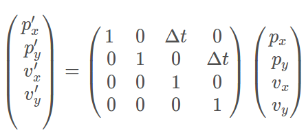
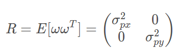
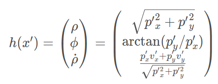
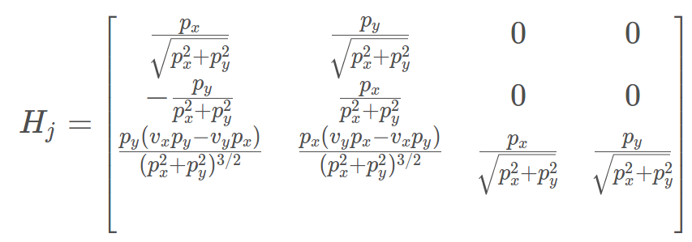
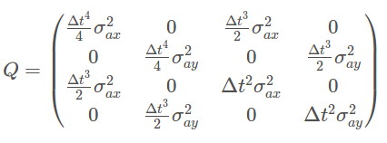

# Extended Kalman Filter Project 
Self-Driving Car Engineer Nanodegree Program

In this project you will utilize a kalman filter to estimate the state of a moving object of interest with noisy lidar and radar measurements.

This project involves the Term 2 Simulator which can be downloaded [here](https://github.com/udacity/self-driving-car-sim/releases)

- `Lidar` measurements are `red circles`, 

- `Radar` measurements are `blue circles` with an arrow pointing in the direction of the observed angle,

- `Estimation` markers are green triangles.

Each row represents a sensor measurement where the first column tells you if the measurement comes from radar (`R`) or lidar (`L`).

- `Radar`, the columns are: 
  - sensor_type, 
  - **rho_measured**, 
  - **phi_measured**, 
  - **rhodot_measured**, 
  - timestamp, 
  - x_groundtruth, 
  - y_groundtruth, 
  - vx_groundtruth, 
  - vy_groundtruth, 
  - yaw_groundtruth, 
  - yawrate_groundtruth.

- `Lidar`, the columns are: 
  - sensor_type, 
  - **x_measured**, 
  - **y_measured**, 
  - timestamp, 
  - x_groundtruth, 
  - y_groundtruth, 
  - vx_groundtruth, 
  - vy_groundtruth, 
  - yaw_groundtruth, 
  - yawrate_groundtruth.

## Variable Definitions

- z: The measurement vector.
- H: The matrix that projects your belief about the object's current state into the measurement space of the sensor
- prime notation:​ Means you have already done the prediction step but have not done the measurement step yet

### State Transition Function: F

In the extended kalman filter project, we used a constant velocity model (CV).



```c++
ekf_.F_ = MatrixXd(4 ,4);
ekf_.F_ <<  1, 0, 1, 0,
            0, 1, 0, 1,
            0, 0, 1, 0,
            0, 0, 0, 1;
```

### Lidar sensors

For laser sensors, we have a 2D measurement vector. Each location component px, py are 
affected by a random noise. So our noise vector ω has the same dimension as z. And it is a 
distribution with zero mean and a 2 x 2 covariance matrix which comes from the product 
of the vertical vector ω and its transpose. 



where R is the measurement noise covariance matrix; in other words, the matrix R 
represents the uncertainty in the position measurements we receive from the laser sensor.

Generally, the parameters for the random noise measurement matrix will be provided by the sensor manufacturer. In the extended Kalman filter project, we have provided R matrices values for both the radar sensor and the lidar sensor.

```c++
//measurement covariance matrix - laser
R_laser_ << 0.0225,   0,
            0,        0.0225;

//measurement covariance matrix - radar
R_radar_ << 0.09,   0,        0,
            0,      0.0009,   0,
            0,      0,        0.09;

```

`H Matrix` :

```c++
Eigen::MatrixXd H_laser_ = MatrixXd(2, 4);
H_laser_ << 1, 0, 0, 0,
            0, 1, 0, 0; 
```
### Radar sensors

For radar, there is **no** `H` matrix that will map the state vector `x` into polar coordinates; instead, you need to calculate the mapping manually to convert from cartesian coordinates to polar coordinates. 



These are multi-dimensional equations, so we will need to use a multi-dimensional Taylor series expansion to make a linear approximation of the hhh function.

we can get the Jacobian Matrix:



```c++
MatrixXd Tools::CalculateJacobian(const VectorXd& x_state) {
	MatrixXd Hj(3, 4);
	float px = x_state(0);
	float py = x_state(1);
	float vx = x_state(2);
	float vy = x_state(3);

	float c1 = px*px + py*py;
	float c2 = sqrt(c1);
	float c3 = c1*c2;

	Hj << (px/c2), 	(py/c2), 0, 0,
          -(py/c1), 	(px/c1), 0,0,
          py*(vx*py-vy*px)/c3, px*(px*vy-py*vx)/c3, px/c2, py/c2;
	return Hj;
}
```
### Process Covariance Matrix Q - Intuition

Combining both 2D position and 2D velocity equations previously deducted formulas we have: 



```c++
ekf_.Q_ = MatrixXd(4, 4);
ekf_.Q_ << dt_4/4 * noise_ax, 0, dt_3/2 * noise_ax, 0,
      0, dt_4/4 * noise_ay, 0, dt_3/2 * noise_ay,
      dt_3/2 * noise_ax, 0, dt_2*noise_ax, 0,
      0, dt_3/2 * noise_ay, 0, dt_2 * noise_ay;
```

---

Once the install for uWebSocketIO is complete, the main program can be built and run by doing the following from the project top directory.

1. mkdir build
2. cd build
3. cmake ..
4. make
5. ./ExtendedKF

INPUT: values provided by the simulator to the c++ program

["sensor_measurement"] => the measurement that the simulator observed (either lidar or radar)


OUTPUT: values provided by the c++ program to the simulator

["estimate_x"] <= kalman filter estimated position x
["estimate_y"] <= kalman filter estimated position y
["rmse_x"]
["rmse_y"]
["rmse_vx"]
["rmse_vy"]

---

## Other Important Dependencies

* cmake >= 3.5
  * All OSes: [click here for installation instructions](https://cmake.org/install/)
* make >= 4.1 (Linux, Mac), 3.81 (Windows)
  * Linux: make is installed by default on most Linux distros
  * Mac: [install Xcode command line tools to get make](https://developer.apple.com/xcode/features/)
  * Windows: [Click here for installation instructions](http://gnuwin32.sourceforge.net/packages/make.htm)
* gcc/g++ >= 5.4
  * Linux: gcc / g++ is installed by default on most Linux distros
  * Mac: same deal as make - [install Xcode command line tools](https://developer.apple.com/xcode/features/)
  * Windows: recommend using [MinGW](http://www.mingw.org/)

## Basic Build Instructions

1. Clone this repo.
2. Make a build directory: `mkdir build && cd build`
3. Compile: `cmake .. && make` 
4. Run it: `./ExtendedKF `

## Generating Additional Data

If you'd like to generate your own radar and lidar data, see the [utilities repo](https://github.com/udacity/CarND-Mercedes-SF-Utilities) for Matlab scripts that can generate additional data.
