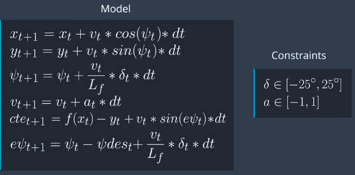
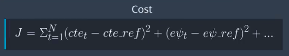
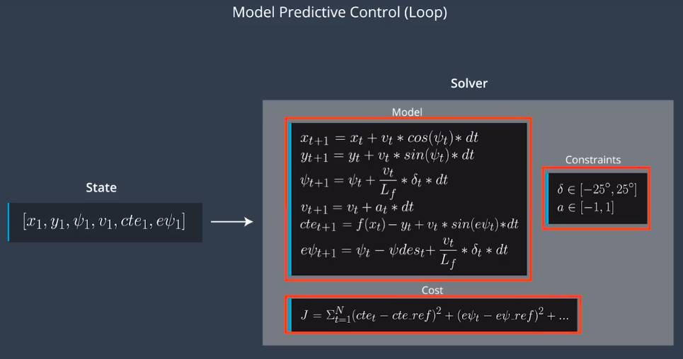

# Controls-MPC
Self-Driving Car Engineer Nanodegree Program.

The goal of Model Predictive Control is to optimize the control inputs: [δ,a]. An optimizer will tune these inputs until a low cost vector of control inputs is found.

MPC attempts to approximate a continuous reference trajectory by means of discrete paths between actuations.

`latency`: In a real car, an actuation command won't execute instantly - there will be a delay as the command propagates through the system. A realistic delay might be on the order of 100 milliseconds.

A contributing factor to latency is actuator dynamics. For example the time elapsed between when you command a steering angle to when that angle is actually achieved. This could easily be modeled by a simple dynamic system and incorporated into the vehicle model. One approach would be running a simulation using the vehicle model starting from the current state for the duration of the latency. The resulting state from the simulation is the new initial state for MPC.

### Vehicle Model

One approach to write a good controller is to first model the vehicle's dynamics and constrains. That way we can analyze and tune the controller more efficiently.

### MPC Algorithm

`First`, we set up everything required for the model predictive control loop. e.g. the duration of trajectory T and dt.

`Next`, we define the vehicle model and constrains such as speed limitation.



`Finally`, we define the *cost function*.



with the setup complete, we begin to state feedback loop.

First, we pass the current state to the model predictive controller.

Next, the optimization solver is called. the solver uses the initial state, the model constrains and cost function to return a vector of control inputs that minimize the cost function. The solver we would use is called `IPOPT`.

we apply the first control input to the vehicle and repeat the loop.



### Cost Function

- cost += pow(v[t] - 35, 2) : penalize the vehicle for not maintaining the reference velocity.
- Euclidean distance.

The cost function can also include the control input. It allows us to penalize the magnitude of inputs as well as change rate. This will yield the smoother lane change. e.g.

```c++
for (int t = 0; t < N-1; t++) {
  cost += pow(delta[t], 2)
}
for (int t = 0; t < N-1; t++) {
  cost += pow(delta[t+1] - delta[t], 2)
  cost += pow(a[t+1] - a[t], 2)
}
```

### Length and Duration

`T` : The prediction horizon is the duration over which future predictions are made.

T = N * dt

N is the number of timesteps in the horizon. dt is how much time elapses between actuations. For example, if N were 20 and dt were 0.5, then T would be 10 seconds.

### Ipopt

Ipopt is the tool we'll be using to optimize the control inputs. It's able to find locally optimal values (non-linear problem!) while keeping the constraints set directly to the actuators and the constraints defined by the vehicle model.

Ipopt requires we give it the `jacobians` and `hessians` directly - it does not compute them for us. Hence, we need to either manually compute them or have a library do this for us. Luckily, there is a library called [`CppAD`](https://www.coin-or.org/CppAD/) which does exactly this.

By using CppAD we don't have to manually compute derivatives, which is tedious and prone to error.

In order to use CppAD effectively, we have to use its types instead of regular double or std::vector types.

Additionally math functions must be called from CppAD.

---

## Model in detail.

**model state includes:**

1. vehicle's x and y coordinates.

2. vehicle's orientation.

3. vehicle's velocity.

4. CTE(cross-track error) and epsi(psi error).

**model actuators:** 

1. acceleration (a).

2. steering angle (delta).


## The reasoning behind N (timestep length) and dt (elapsed duration between timesteps) values.

The value of N * dt means MPC consider the length of duration in which to determine a corrective trajectory. Time N*dt defines the predition horizon.

Shorter time steps dt leads MPC more accuracy, but increasing latency.

Longer prediction horizons leads actuator more smoother.

Previous values tried:

	N: 5 , dt: 0.01
	N: 5 , dt: 0.1
	N: 5 , dt: 0.5
	N: 10, dt: 0.01
	N: 10, dt: 0.1
	N: 10, dt: 0.5
	N: 20, dt: 0.01
	N: 20, dt: 0.1
	N: 20, dt: 0.5

## Polynomial Fitting and MPC Preprocessing.

Firstly, i transform waypoints into vehicle's coordinates by using the following equation:

- X' = dx * cos(-psi) - dy * sin(-psi)
- Y' = dx * sin(-psi) + dy * cos(-psi)

where `dx = ptsx[i] - px` and `dy = ptsy[i] - py`.

Then, I use `polyfit()` function to fit them. Finally, I get the `coeffs` parameters.

The vehicle initial state is : 0, 0, 0, v, cte, epsi.

## How to deal with 100millisecond latency.

The solution given by MPC is meant for immediate effect but when the actuator receives them, it will already be 100ms too late. Therefore, to mitigate this problem, we need to send them the correct values that are meant for after 100ms. The most popular method is to use kinematic equations to predict the states for after 100ms before sending them to MPC. The update can be placed before polynomial fitting using global map coordinate, or after polynomial fitting and use vehicle map coordinate. 

Firts:

At current time t=0, your car's states are px=0, py=0, psi=0 right after converting to car coordinate. I calcualte cte and epsi

```
double cte = polyeval(coeffs, 0);
double epsi = 0 - atan(coeffs[1]);
```

Then:

Now predict all the states for t=latency. I simplify them further knowing some of the variables are 0.

```
double delta = j[1]["steering_angle"];
double latency = 0.1;
double Lf = 2.67;

//to convert miles per hour to meter per second I multiply 0.44704.
double cur_x = 0.0;
double cur_y = 0.0;
double cur_psi = 0.0;
double cur_v = v;
double cur_a = a;
double cur_delta = delta;

double pred_x = cur_x + v * cos(cur_psi) * latency;
double pred_y = cur_y + v * sin(cur_psi) * latency;
double pred_psi = cur_psi + cur_v * cur_delta * latency / Lf;
double pred_v = cur_v + cur_a * latency;
double pred_cte = cte + cur_v * sin(epsi) * latency; 
double pred_epsi = epsi + cur_v * cur_delta * latency / Lf;
```

# Websocket Data

This topic describes the JSON object send back from the simulator command server.

Fields:

* `ptsx` (Array<float>) - The global x positions of the waypoints.
* `ptsy` (Array<float>) - The global y positions of the waypoints. This corresponds to the z coordinate in Unity
since y is the up-down direction.
* `psi` (float) - The orientation of the vehicle in **radians** converted from the Unity format to the standard format expected in most mathemetical functions (more details below).
* `psi_unity` (float) - The orientation of the vehicle in **radians**. This is an orientation commonly used in [navigation](https://en.wikipedia.org/wiki/Polar_coordinate_system#Position_and_navigation).
* `x` (float) - The global x position of the vehicle.
* `y` (float) - The global y position of the vehicle.
* `steering_angle` (float) - The current steering angle in **radians**.
* `throttle` (float) - The current throttle value [-1, 1].
* `speed` (float) - The current velocity in **mph**.

### `psi` and `psi_unity` representations

`psi`

```
//            90
//
//  180                   0/360
//
//            270
```


`psi_unity`

```
//            0/360
//
//  270                   90
//
//            180
```

## Intalling Ipopt and CppAD

### Installation Process

1.  Clone this repository and navigate to the cloned directory
2.  [Download](https://www.coin-or.org/download/source/Ipopt/) the appropriate version of Ipopt (3.12.7 or higher) from the link below.  You may also use wget or a similiar command to download the source from the command line (see Linux instructions).
3.  Follow the instructions for your environment

* [Ipopt](https://projects.coin-or.org/Ipopt)
  * **Linux:**
    * ```sudo apt-get install gfortran```
    *  ```apt-get install unzip```
    * ```wget https://www.coin-or.org/download/source/Ipopt/Ipopt-3.12.7.zip && unzip Ipopt-3.12.7.zip && rm Ipopt-3.12.7.zip```
    * Call `install_ipopt.sh` with the source directory as the first argument, ex: ```./install_ipopt.sh Ipopt-3.12.7``` or ```bash install_ipopt.sh Ipopt-3.12.7```
* [CppAD](https://www.coin-or.org/CppAD/)
  * Linux `sudo apt-get install cppad` or equivalent.