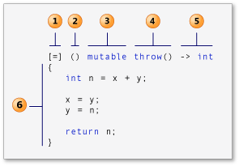

 # CarND-Path-Planning-Project
[Udacity](www.udacity.com) Self-Driving Car Engineer Nanodegree Program

## Basic Build Instructions
1. Download [simulator](https://github.com/udacity/self-driving-car-sim).
2. Run `./install-ubuntu.sh`.
3. Make a build directory: `mkdir build && cd build`
4. Compile: `cmake .. && make`
5. Run it: `./path_planning`.

### Docker

I have written a Dockerfile to build a docker environment. However, I had not idea that why I can't clone in docker. Therefore, there must git clone uWS at first before build dockerfile.

```bash
git clone https://github.com/uWebSockets/uWebSockets
cd uWebSockets
git checkout e94b6e1
docker build --tag carnd:path_planning .
rm -r uWebSockets
docker run -i -t -v src:/root/workspace/path_planning -p 4567:4567 --name path_planning imageID
```

## Implementation.

### [uWebSockets](https://github.com/uNetworking/uWebSockets)
µWS ("microWS") is a WebSocket and HTTP implementation for clients and servers.
```c++
#include <uWS/uWS.h>

int main() {
  uWS::Hub h;
  //The `uWS::Hub` consists of a client group and a server group. 
  h.onMessage(
    [&mycar]( uWS::WebSocket<uWS::SERVER> ws, 
              char *data, 
              size_t length,
              uWS::OpCode opCode) {...});

  h.onHttpRequest(
          []( uWS::HttpResponse *res, 
              uWS::HttpRequest req, 
              char *data,
              size_t, size_t) {...});

  h.onConnection(
        [&h]( uWS::WebSocket<uWS::SERVER> ws, 
              uWS::HttpRequest req) {...});

  h.onDisconnection(
        [&h]( uWS::WebSocket<uWS::SERVER> ws, 
              int code,
              char *message, size_t length) {...});

  int port = 4567;
  if (h.listen(port)) {
    std::cout << "Listening to port " << port << std::endl;
  } else {
    std::cerr << "Failed to listen to port" << std::endl;
    return -1;
  }
  h.run();

}
```
### Why we need `WebSocket`?

WebSocket is a computer communications protocol. Unlike HTTP, WebSocket provides full-duplex communication. `WebSocket` can provides a standard way for server(Simulator in our case) to send messages to the client(Path Planning Program `./path_planning` in our case.) without being requested by client.

`HTTP` functions as a request–response protocol in the client–server computing model.The client submits an HTTP request message to the server. The server returns a response message to the client.

References: [WebSocket](https://en.wikipedia.org/wiki/WebSocket), [HTTP](https://en.wikipedia.org/wiki/Hypertext_Transfer_Protocol), [WebSocket 教程](http://www.ruanyifeng.com/blog/2017/05/websocket.html).

### Lambda Expressions in C++



Structural elements of a lambda expression

\[capture\]\(parameters\) -> return_type { function_body }

1. capture clause (Also known as the lambda-introducer in the C++ specification.)
2. parameter list Optional. (Also known as the lambda declarator)
3. mutable specification Optional.
4. exception-specification Optional.
5. trailing-return-type Optional.
6. lambda body.

References: [Lambda Expressions in C++](https://msdn.microsoft.com/en-us/library/dd293608.aspx), [wiki](https://en.wikipedia.org/wiki/Anonymous_function#C++_(since_C++11)).

### [JSON for Modern C++](https://github.com/nlohmann/json)

`WebSocket` transfers information by using JSON format. `nlohmann/json` is used for decoding information.
After decoding, the telemetry information would be used for path planning algorithm.

```c++
#include "utils/json.hpp"

auto j = json::parse(s);
string event = j[0].get<string>();

if (event == "telemetry") {
  // My algorithm is implemented in here!
}

```

- [`json::parse()`](https://nlohmann.github.io/json/classnlohmann_1_1basic__json_aa9676414f2e36383c4b181fe856aa3c0.html#aa9676414f2e36383c4b181fe856aa3c0)

---

## Implementation.


The algorithm should finds a solution if it's exists. Given a cost function, the planner should find a minimal cost solution.

- MAP : `/src/map/` store information about map.

### Safe Distance

Consider the simple case of two cars Cf , Cego , driving at the same speed, one behind the other, along a straight road, without performing any lateral manoeuvres. Assume Cf , the car at the front, suddenly brakes because of an obstacle appearing on the road, and manages to avoid it. Unfortunately, Cego did not keep enough of a distance from Cf , is not able to respond in time, and crashes into Cf’s rear side. It is clear that the blame is on Cego; it is the responsibility of the rear car to keep safe distance from the front car, and to be ready for unexpected, yet reasonable, braking.

In our case:

- acceleration <= 10 m/s^2
- jerk <= 10 m/s^3

The simulator has about 3~4 timestamp latency. Each timestamp equal to 1s/50points = 0.02s.
Therefore, we can assume that `response time` = 1s which has enough capacity to simulate driving in real world.

References: 
  - *On a Formal Model of Safe and Scalable Self-driving Cars.*

### Jerk minimizing trajectory


Now we have 6 coefficients, which means 6 tuneable parameters that we can choose to define the shape of trajectory. We would like to constrain are initial position, velocity and acceleration as well as final position, velocity and acceleration.


There have 12 varialbes to pick in order to fully define the motion of our vehicle in frenet coordinatese over time.

**How we can find the 6 coefficients that describe the trajectory polynomial?**

We choose initial time as 0, then we get first 3 coefficients.


Then the last 3 coefficients can be solved by following matrix:


Now we can use S jerk minimization solver and D jerk minimization solver to get the trajectory points.


---

I create a class named `Vehicle` and I first create a Vehicle object named `mycar` in line-57 in main.cpp. I build a structure named `CarLocalizationData` in Types.h. There is a `CarLocalizationData` type named `vLocal`. I store my car's localization data in `vLocal`. Then I pass this data and previous path data to `mycar` by using Update() function from line 82 to line 105 in main.cpp.
Next, I use `calTrajWaypoints()` to calculate next wap points, and then use `getXvals()` as well as `getYvals()` function to get points.

### Details in Vehicle.
- **Update()** : I use this function to update current car's localization data including car's speed and yaw angle. At the end of this function, I call `genPredictionsFromSensorData()` function and `genTraj()` function.
- **genPredictionsFromSensorData()** : In this function I predict other car's trajectory from sensor data. I also check the buffer in my lane. If the gap between cars is too small, self driving car should lower the speed.
- **genTraj()** : I call this function to generate best trajectory. In this function, the car will call anthoer function named `genBestTarget()` to calculate the best trajectory. The best trajectory is defined by the cost function, the lower cost the moer performance in this trajectory.

### Best Trajectory
Using the ego car "planning state", sensor fusion predictions, and Vehicle class methods mentioned above, an optimal trajectory is produced.

All cost function are private function in the class `Vehicle`

- Collision cost: penalizes a trajectory that collides with any predicted traffic trajectories.
- Buffer cost: penalizes a trajectory that comes within a certain distance of another traffic vehicle trajectory.
- In-lane buffer cost: penalizes driving in lanes with relatively nearby traffic.
- Efficiency cost: penalizes trajectories with lower target velocity.
- Not-middle-lane cost: penalizes driving in any lane other than the center in an effort to maximize available state options.

### Simulator.
You can download the Term3 Simulator which contains the Path Planning Project from the [releases tab](https://github.com/udacity/self-driving-car-sim/releases/tag/T3_v1.2)

The simulator runs a cycle every 20 ms (50 frames per second).

### Goals
In this project your goal is to safely navigate around a virtual highway with other traffic that is driving +-10 MPH of the 50 MPH speed limit. You will be provided the car's localization and sensor fusion data, there is also a sparse map list of waypoints around the highway. The car should try to go as close as possible to the 50 MPH speed limit, which means passing slower traffic when possible, note that other cars will try to change lanes too. The car should avoid hitting other cars at all cost as well as driving inside of the marked road lanes at all times, unless going from one lane to another. The car should be able to make one complete loop around the 6946m highway. Since the car is trying to go 50 MPH, it should take a little over 5 minutes to complete 1 loop. Also the car should not experience total `acceleration` over **10 m/s^2** and `jerk` that is greater than **10 m/s^3**.

#### The map of the highway is in data/highway_map.txt
Each waypoint in the list contains  [x,y,s,dx,dy] values. x and y are the waypoint's map coordinate position, the s value is the distance along the road to get to that waypoint in meters, the dx and dy values define the unit normal vector pointing outward of the highway loop.

The highway's waypoints loop around so the frenet s value, distance along the road, goes from 0 to 6945.554.

Here is the data provided from the Simulator to the C++ Program

#### Main car's localization Data (No Noise)

["x"] The car's x position in map coordinates

["y"] The car's y position in map coordinates

["s"] The car's s position in frenet coordinates

["d"] The car's d position in frenet coordinates

["yaw"] The car's yaw angle in the map

["speed"] The car's speed in MPH

#### Previous path data given to the Planner

//Note: Return the previous list but with processed points removed, can be a nice tool to show how far along
the path has processed since last time. 

["previous_path_x"] The previous list of x points previously given to the simulator

["previous_path_y"] The previous list of y points previously given to the simulator

#### Previous path's end s and d values 

["end_path_s"] The previous list's last point's frenet s value

["end_path_d"] The previous list's last point's frenet d value

#### Sensor Fusion Data, a list of all other car's attributes on the same side of the road. (No Noise)

- ["sensor_fusion"] A 2d vector of cars:
  - [0] car's unique ID, 
  - [1] car's x position in map coordinates, 
  - [2] car's y position in map coordinates, 
  - [3] car's x velocity in m/s, 
  - [4] car's y velocity in m/s, 
  - [5] car's s position in frenet coordinates, 
  - [6] car's d position in frenet coordinates. 

## Details

1. The car uses a perfect controller and will visit every (x,y) point it recieves in the list every .02 seconds. The units for the (x,y) points are in meters and the spacing of the points determines the speed of the car. The vector going from a point to the next point in the list dictates the angle of the car. Acceleration both in the tangential and normal directions is measured along with the jerk, the rate of change of total Acceleration. The (x,y) point paths that the planner recieves should not have a total acceleration that goes over 10 m/s^2, also the jerk should not go over 50 m/s^3. (NOTE: As this is BETA, these requirements might change. Also currently jerk is over a .02 second interval, it would probably be better to average total acceleration over 1 second and measure jerk from that.

2. There will be some latency between the simulator running and the path planner returning a path, with optimized code usually its not very long maybe just 1-3 time steps. During this delay the simulator will continue using points that it was last given, because of this its a good idea to store the last points you have used so you can have a smooth transition. previous_path_x, and previous_path_y can be helpful for this transition since they show the last points given to the simulator controller with the processed points already removed. You would either return a path that extends this previous path or make sure to create a new path that has a smooth transition with this last path.

## Tips

A really helpful resource for doing this project and creating smooth trajectories was using http://kluge.in-chemnitz.de/opensource/spline/, the spline function is in a single hearder file is really easy to use.

---

## Dependencies

* cmake >= 3.5
  * All OSes: [click here for installation instructions](https://cmake.org/install/)
* make >= 4.1
  * Linux: make is installed by default on most Linux distros
  * Mac: [install Xcode command line tools to get make](https://developer.apple.com/xcode/features/)
  * Windows: [Click here for installation instructions](http://gnuwin32.sourceforge.net/packages/make.htm)
* gcc/g++ >= 5.4
  * Linux: gcc / g++ is installed by default on most Linux distros
  * Mac: same deal as make - [install Xcode command line tools]((https://developer.apple.com/xcode/features/)
  * Windows: recommend using [MinGW](http://www.mingw.org/)
* [uWebSockets](https://github.com/uWebSockets/uWebSockets)
  * Run either `install-mac.sh` or `install-ubuntu.sh`.
  * If you install from source, checkout to commit `e94b6e1`, i.e.
    ```
    git clone https://github.com/uWebSockets/uWebSockets 
    cd uWebSockets
    git checkout e94b6e1
    ```

## Gif Tool

Using [`Peek`](https://github.com/phw/peek) to create gif.

[install in ubuntu](https://github.com/phw/peek#ubuntu)

```bash
sudo add-apt-repository ppa:peek-developers/stable
sudo apt update
sudo apt install peek
```