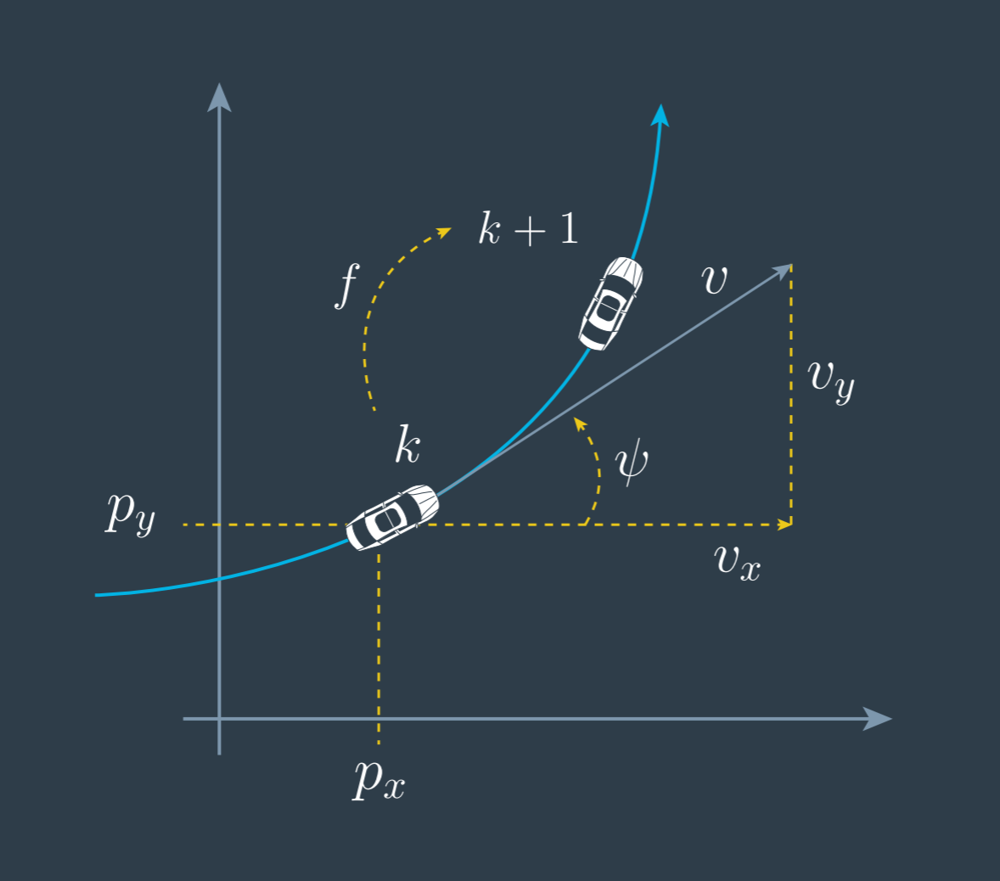

# Unscented Kalman Filter 
Self-Driving Car Engineer Nanodegree Program

## CTRV Model

In CV(constant velocity) model, the position estimation would tend to result outside of the actually driven circle when a car goes into a turn.

In this project utilize an Unscented Kalman Filter to estimate the state of a moving object of interest with noisy lidar and radar measurements. We work on constant turn rate and velocity magnitude model (`CTRV`).

In CTRV, the state space will use x, y position, speed and yaw angle. Since we also want to estimate yaw angle rate, so we add it into the state space. the state space vector is as following:

  | 

Then we can calculate the differential equation of state space. Therefore we can derive the process model `f`. the differential equation is as above:

and the process model can derive and solution as following equation:

## UKF

To deal with non-linear function, the UKF is uses the `unscented transformation`. 

**Kalman Filter** 

Q is the the covariance matrix of the process noise. We can use the kalman filter to solve linear problem.

But in nonlinear problem,  predicting with a nonlinear function provides a distribution which is generally not normally distribution anymore. And it is difficult to calculate this predicted distribution. However it can be calculated numerically. 

UKF will still work as if the prediction was still normally distribution. It's approximation! What we want to find now is the normally distribution that represents the real predicted distribution as close as possible.

**How to find the mean vector and covariance matrix to approximate the real predicted distribution?**

`Unscented Transformation` solves this problem by using sigma points. The basic idea is that it is very easy to transform individual points of state space through the nonlinear function. The sigma points are choosen arround the mean state and in a certain relation to the standard deviation sigma of every state dimension.  These sigma points represents of the whole distribution. All you have to do is transform the sigma points through the nonlinear function and calculate the mean vector and covariance matrix of points in the predicted space. It would gives you a useful approximation. 

Of course,  this algorithm can apply in the linear case. In this case you can even find the exact solution of the sigma points. But the UKF are more expensive in calculation time.

We can split UKF into 3 parts:

1. a good way to choose sigma points.
2. predict the sigma points. (just insert the points into the process nonlinear or linear function.)
3. calculate mean vector and covariance matrix of  the predicted points.

---

This project involves the Term 2 Simulator which can be downloaded [here](https://github.com/udacity/self-driving-car-sim/releases)

Once the install for uWebSocketIO is complete, the main program can be built and ran by doing the following from the project top directory.

1. mkdir build
2. cd build
3. cmake ..
4. make
5. ./UnscentedKF

Here is the main protcol that main.cpp uses for uWebSocketIO in communicating with the simulator.

["sensor_measurement"] => the measurment that the simulator observed (either lidar or radar)

OUTPUT: values provided by the c++ program to the simulator

["estimate_x"] <= kalman filter estimated position x
["estimate_y"] <= kalman filter estimated position y
["rmse_x"]
["rmse_y"]
["rmse_vx"]
["rmse_vy"]

---

## Other Important Dependencies
* cmake >= 3.5
  * All OSes: [click here for installation instructions](https://cmake.org/install/)
* make >= 4.1 (Linux, Mac), 3.81 (Windows)
  * Linux: make is installed by default on most Linux distros
  * Mac: [install Xcode command line tools to get make](https://developer.apple.com/xcode/features/)
  * Windows: [Click here for installation instructions](http://gnuwin32.sourceforge.net/packages/make.htm)
* gcc/g++ >= 5.4
  * Linux: gcc / g++ is installed by default on most Linux distros
  * Mac: same deal as make - [install Xcode command line tools](https://developer.apple.com/xcode/features/)
  * Windows: recommend using [MinGW](http://www.mingw.org/)

## Basic Build Instructions

1. Clone this repo.
2. Make a build directory: `mkdir build && cd build`
3. Compile: `cmake .. && make`
4. Run it: `./UnscentedKF` Previous versions use i/o from text files.  The current state uses i/o
from the simulator.